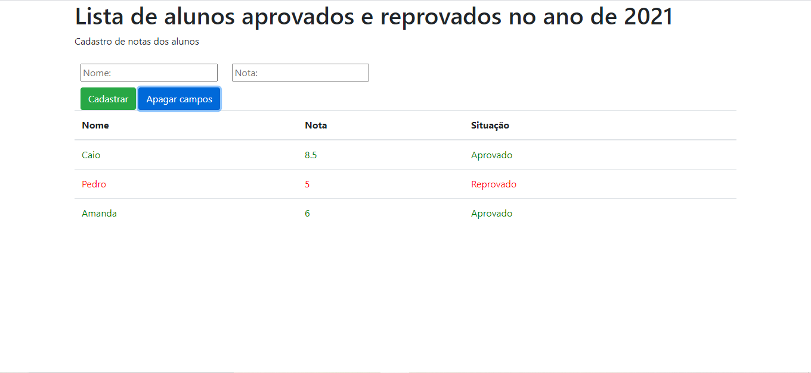

# TodoList Javascript

Um todoList com Javascript puro

## Sobre o Projeto

Este projeto consiste em uma tabela de alunos aprovados e reprovados

## Demonstração do projeto

Foto do projeto

Resultado final: https://admiring-hamilton-90fe3a.netlify.app/

## Objetivo do projeto

Projeto desenvolvido para treinar Javascript Puro

## Tecnologias Usadas no projeto

Projeto feito utilizando as seguintes linguagens/tecnologias: 

* HTML/CSS
* Bootstrap 4
* Javascript

## Instalação

Para que este projeto rode em sua máquina, siga os passos abaixo:

Clone este repositório em uma pasta em sua máquina  
$ git clone https://github.com/Leveditor/todoList.git

Entre na pasta  
$ cd todoList
